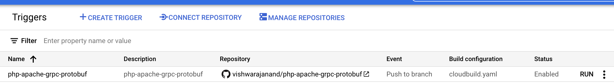

# php-apache-grpc-protobuf
This repository helps developers create a docker container whereby a PHP code can be run to serve requests over apache server. Much of the configuration is sourced from [Google Doc: Deploy a PHP app in a container image](https://cloud.google.com/run/docs/quickstarts/build-and-deploy/deploy-php-service).


## Usage Instructions

The built image is available publicly in [dockerhub.io](https://hub.docker.com/repository/docker/vishwaraj00/php-8.0-apache-grpc-protobuf).
And can be consumed in other `Dockerfile` as follows:

```
FROM vishwaraj00/php-8.0-apache-grpc-protobuf as build
```

## Steps to Run Locally

1. `docker build -t vishwaraj00/php-8.0-apache-grpc-protobuf .`
2. `docker push vishwaraj00/php-8.0-apache-grpc-protobuf`


## Steps to Run on gCloud

Run the following command to execute this cloudbuild:

`gcloud builds submit . --config=cloudbuild.yaml`

## CI/CD

A Google Cloud Build is triggered on `main` branch of this repo, which automatically builds a docker image from `Dockerfile` and pushes to dockerhub for immediate public use typically in about ~30 mins.

[Google Cloud Build Trigger Private Link](https://console.cloud.google.com/cloud-build/triggers/edit/cf4c7004-3cf2-46fc-a594-8c21e02a9704?project=968036764985)


